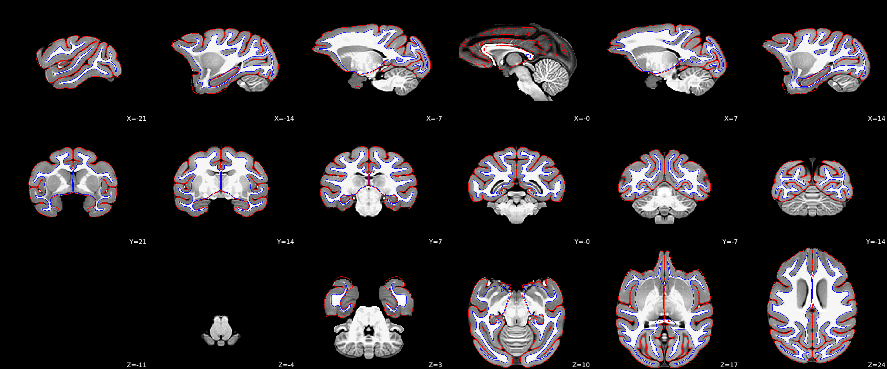
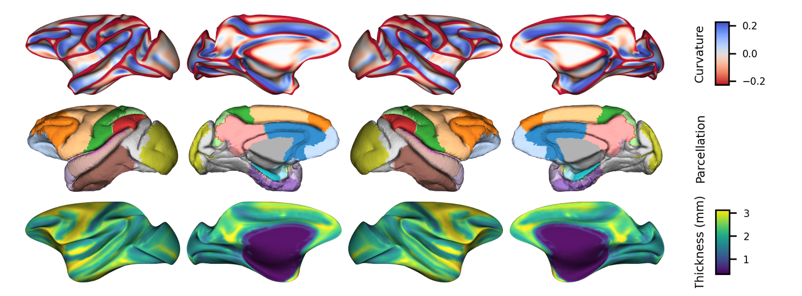
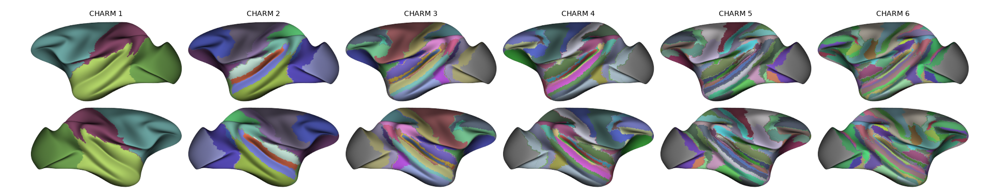
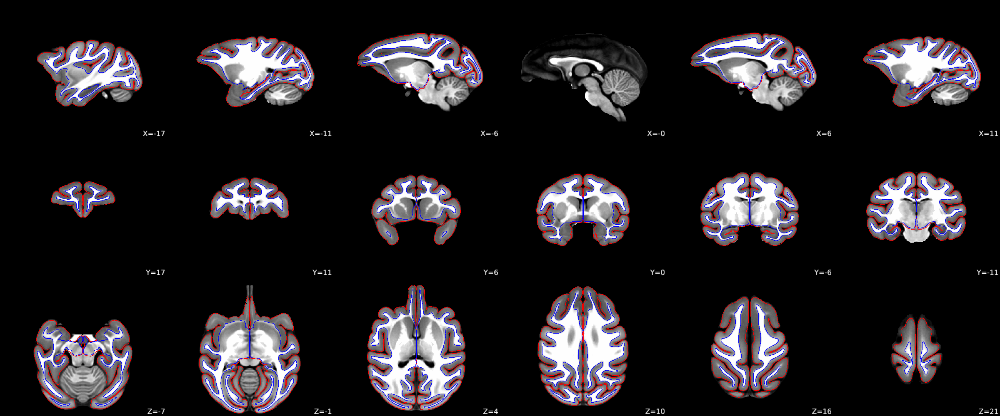
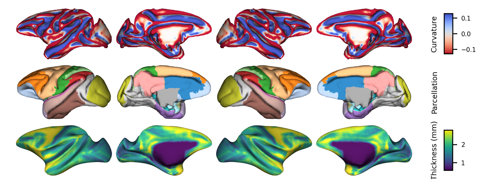
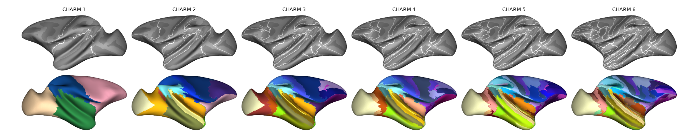

# Macaque Template Surfaces (FreeSurfer Format)

FreeSurfer-format cortical surfaces for common macaque MRI volume templates.
These surfaces support visualization and analysis in standard neuroimaging workflows.

## Templates

- **NMT2Sym** — NMT v2 0.5 mm symmetric macaque template ([NMT v2](https://afni.nimh.nih.gov/pub/dist/doc/htmldoc/nonhuman/macaque_tempatl/template_nmtv2.html))
- **MEBRAINS** — EBRAINS macaque template ([EBRAINS](https://search.kg.ebrains.eu/instances/de58ab47-b980-437c-8906-87f1123e14fb))

## Generation

Surfaces were derived from the white and pial surfaces provided with each volume template, along with NMT [CHARM](https://afni.nimh.nih.gov/pub/dist/doc/htmldoc/nonhuman/macaque_tempatl/atlas_charm.html) and [SARM](https://afni.nimh.nih.gov/pub/dist/doc/htmldoc/nonhuman/macaque_tempatl/atlas_sarm.html) parcellations. 

The full FreeSurfer-style pipeline (sphere, cortical ribbon, curvature, thickness, etc.) was completed using **Brainana**—a non-human primate MRI volume and surface preprocessing pipeline (in preparation).

## Quality control

### NMT2Sym

Tissue segmentation


Cortical surfaces and measures  


CHARM projection on the surface


### MEBRAINS

Tissue segmentation 


Cortical surfaces and measures  


CHARM projection on the surface



## Repository structure

```
macaque_surface/
├── sub-xxx/
│   ├── mri/        # Volumetric segmentations and transforms
│   ├── surf/       # Cortical surface meshes (white, pial, inflated, etc.)
│   ├── label/      # Cortical labels and parcellations
│   ├── atlas/      # CHARM atlases projected on surface
│   ├── stats/      # Surface-based statistics
│   └── ...
└── sub-xxx/
    └── ...
```

## Citation and references

When using these surfaces, please cite the respective template sources (NMT v2, MEBRAINS).
